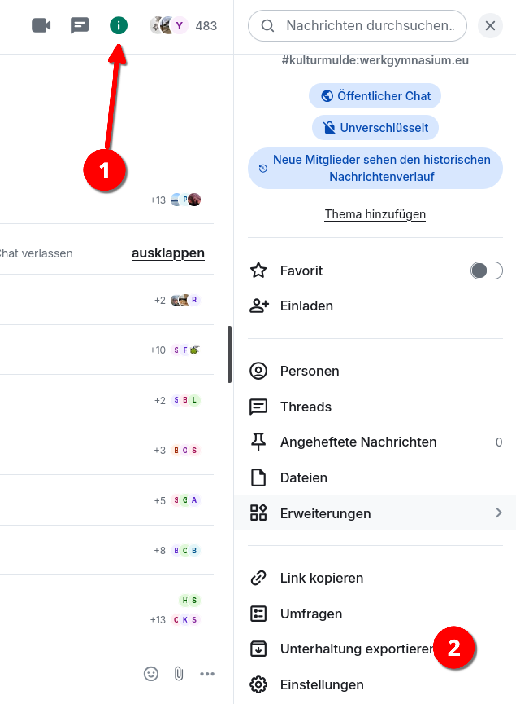
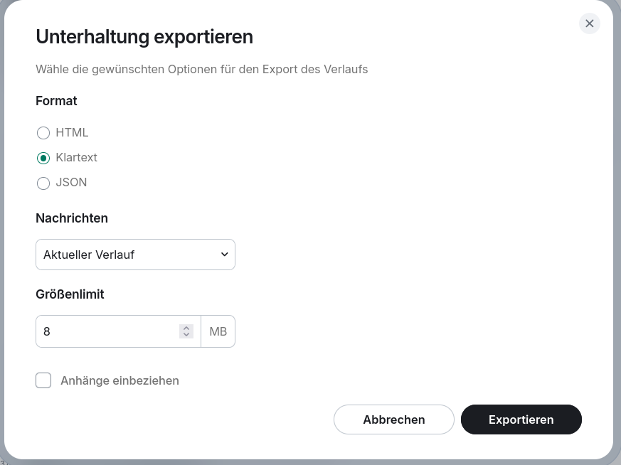

# Chats sichern

!!! danger "Nur im Browser"
    **Sichern geht nur im Browser** ([Anmelden im Browser](web.md)).

Man muss manchmal seine Chats sichern, wenn dort wichtige Informationen drin sind. 

Im Browser kann man dann **rechts oben** auf das Infosymbol tippen

Anschließend wählt man das passende Format und klickt auf `exportieren`.

!!! question "Welches Format nehme ich da?"

    Für das meiste wird **Klartext** ausreichen. Dann bekommt man eine `.txt` Datei.

!!! warning "Anhänge"
    
    Will man die Dateien mitsichern muss man auf das Häkchen bei `Anhänge exportieren` setzen.