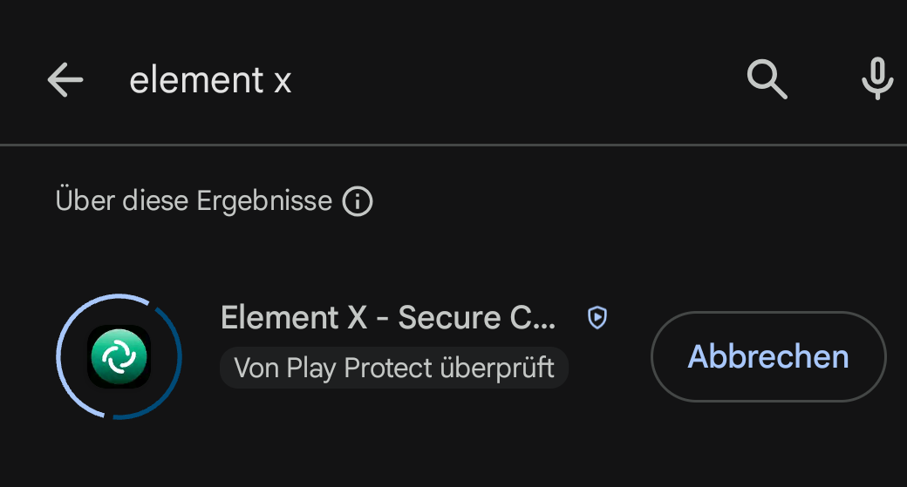
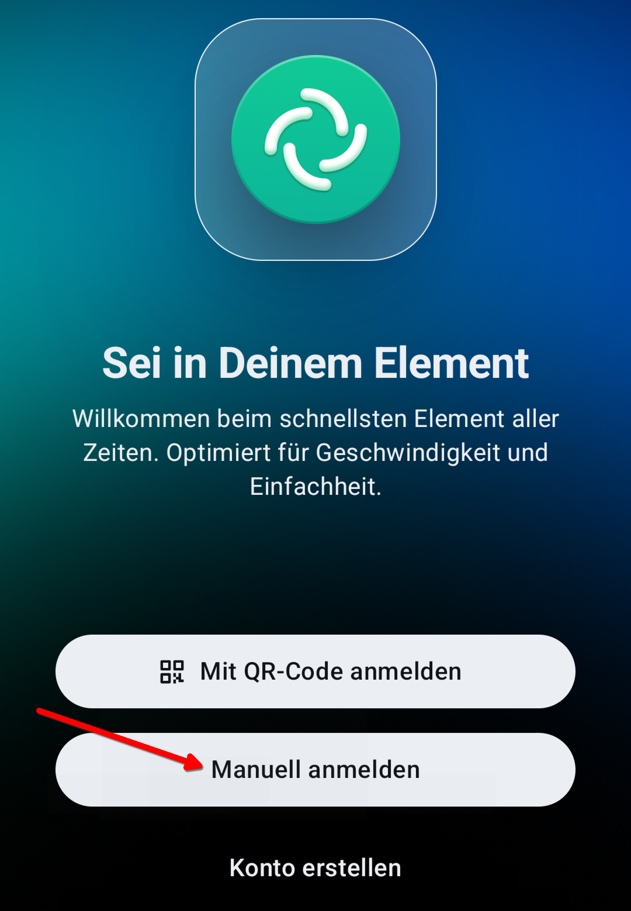
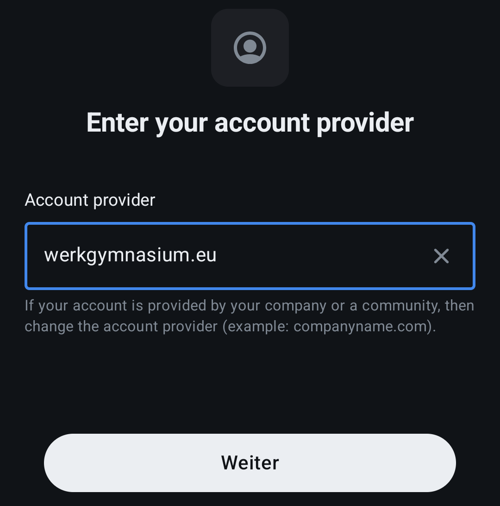
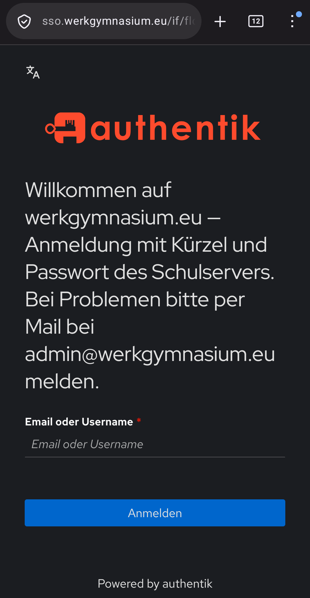
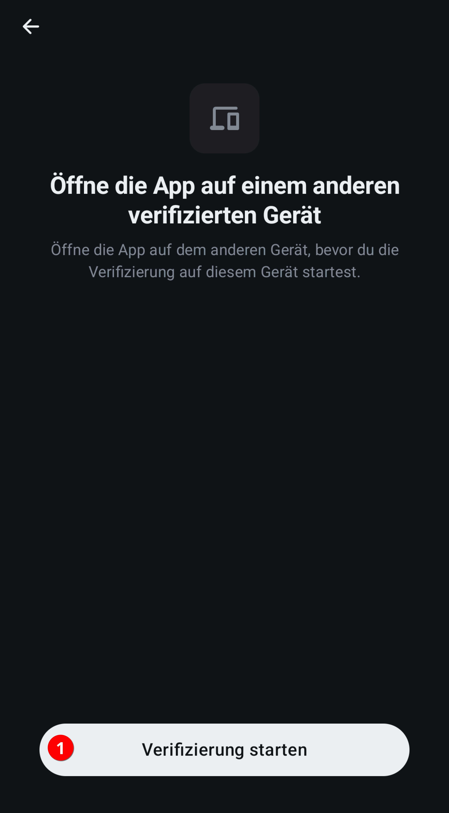
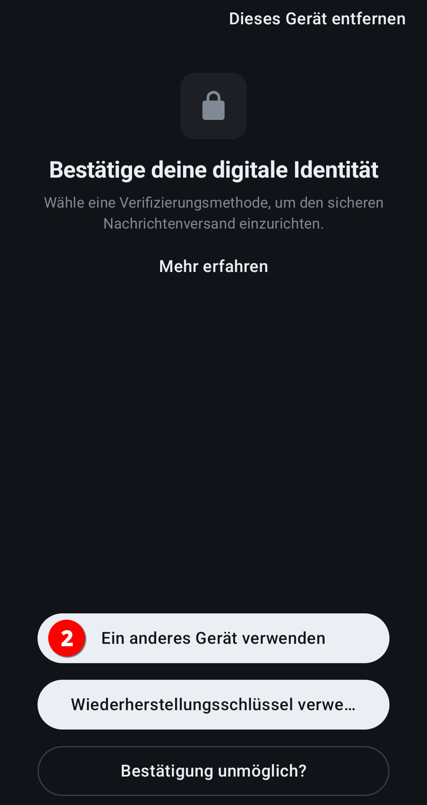

# Element X einrichten

Die App für Android und iPhone. Von der Installation bis zur ersten Nachricht
sind es fünf Schritte.

## 1. Die richtige App downloaden und installieren

!!! warning "Es gibt zwei Apps, die fast gleich heißen"

    Neben **Element X** liegt im Store noch die ältere App, die nur **Element**
    heißt. Beide funktionieren, aber die Anleitungen hier beschreiben Element X
    — die mit dem **X** im Namen.

    Wer die falsche erwischt hat: deinstallieren, die andere holen. Es geht
    dabei nichts verloren, die Nachrichten liegen ohnehin auf dem Server.

Im **Play Store** (Android) oder im **App Store** (iPhone) nach `Element X`
suchen und installieren.

## 2. Anmelden auswählen

App öffnen. Auf dem Startbildschirm auf **„ Manuell Anmelden“** tippen (je nach Version
heißt der Knopf „Ich habe bereits ein Konto“). Ein Konto **anlegen** muss man
nicht — es gibt schon eins, nämlich das Schulkonto.

## 3. Den Server der Schule eintragen

Jetzt kommt der Schritt, an dem es am ehesten schiefgeht. Die App schlägt
`matrix.org` vor. Das ist **nicht** der Server der Schule.

Auf **„Ändern“** beziehungsweise **„Bearbeiten“** tippen und eintragen: `werkgymnasium.eu`

## 4. Mit dem Schulkonto anmelden

Die App öffnet ein Browserfenster mit authentik. Dort das
gewohnte Schulkonto eingeben — dasselbe Kürzel und Kennwort wie am Schulrechner.

Wenn danach gefragt wird, ob die App auf das Konto zugreifen darf: bestätigen.
Das Browserfenster schließt sich anschließend von selbst, und die App macht
weiter.

## 5. Die Sitzung verifizieren

??? info "Verifizieren?"
    Die Geräteverifizierung schützt vor Betrügern und anderen böswilligen Akteuren, die Angriffe im Man-in-the-Middle-Stil versuchen.

    Mit Element kannst Du jedes Gerät verfolgen, das an einer verschlüsselten Konversation teilgenommen hat. Wenn ein neues und unerwartetes Gerät beitritt, kannst Du mithilfe der Geräteüberprüfung überprüfen, ob es sich um die richtige Person handelt. Wenn Du den Verdacht hast, dass ein vertrauenswürdiges Gerät in die falschen Hände geraten ist, kannst Du dieses Vertrauen aufheben und ihm den Zugriff auf die laufende verschlüsselte Konversation entziehen. 

Ein frisch angemeldetes Gerät kann die alten Nachrichten noch nicht lesen. Was
jetzt zu tun ist, hängt davon ab, ob schon ein anderes Gerät angemeldet ist:

=== "Es gibt schon ein anderes Gerät"

    Am einfachsten ist die Bestätigung dort: Auf dem alten Gerät erscheint eine
    Nachfrage, danach zeigen beide dieselben Zeichen oder Bilder. Stimmen sie
    überein, auf beiden Seiten bestätigen.

    

    

    

    

    

    Alternativ kopiert man den **Wiederherstellungsschlüssel** ein — die lange
    Folge aus Buchstaben und Ziffern vom ersten Einrichten.

    

=== "Es ist das allererste Mal"

    Dann gibt es nichts zu bestätigen, und die App legt die Wiederherstellung
    neu an. Sie zeigt dabei einmal den **Wiederherstellungsschlüssel** an.

    !!! danger "Diesen Schlüssel wegspeichern — jetzt"

        Ohne ihn kommt man auf einem neuen Gerät nicht mehr an alte Nachrichten.
        Niemand kann ihn nachträglich herausgeben, auch die Schule nicht.

        Gute Orte: der Passwortspeicher des Handys, ein Passwortprogramm, ein
        Zettel zu Hause. Schlechter Ort: eine Nachricht an sich selbst im Chat
        — die ist ja genau das, was ohne den Schlüssel unlesbar wird.

!!! tip "Wenn die App gar nicht erst fragt"

    Element X erledigt diesen Schritt beim Anmelden. Bleibt die Frage aus und
    das Gerät gilt trotzdem als unbestätigt, holt man sie nach unter
    **Einstellungen → Verschlüsselung → Dieses Gerät verifizieren** (je nach
    Version heißt der Punkt *Sitzungen*).

    Der häufigste Grund fürs Ausbleiben: Das andere Gerät war nicht offen.
    Die Bestätigung läuft zwischen zwei **gleichzeitig geöffneten** Programmen
    — ein geschlossenes Browserfenster kann nichts bestätigen. Der zweite
    Grund: Das andere Gerät ist selbst noch nicht bestätigt und kann deshalb
    für keines bürgen. Dann bleibt der Wiederherstellungsschlüssel.

## 6. Benachrichtigungen erlauben

Zum Schluss fragt das Handy, ob die App Benachrichtigungen schicken darf.
**Erlauben** — sonst merkt man neue Nachrichten erst, wenn man die App von sich
aus öffnet.

Wer es später ändern will: in den Einstellungen des Handys unter *Apps →
Element X → Benachrichtigungen*.

---

Fertig. Wie man jemanden findet und wie die eigene Adresse aussieht, steht auf
der [Übersichtsseite](index.md).

## Wenn es klemmt

??? question "Die App sagt, der Server sei nicht erreichbar."

    Meist ein Tippfehler in Schritt 3. Es muss genau `werkgymnasium.eu` mit  dort
    stehen — mit **.eu**, ohne `https://`, ohne `www.`, ohne Leerzeichen am Ende, das die
    Tastatur des Handys gern anhängt.

??? question "Nach dem Anmelden ist die Liste leer."

    Beim ersten Start holt die App die Unterhaltungen erst nach und nach. Ein
    paar Sekunden warten. Bleibt es leer, ist die Anmeldung womöglich auf
    `matrix.org` gelandet statt beim Server der Schule — dann in den
    Einstellungen abmelden und ab Schritt 2 neu anfangen.

??? question "Alle Nachrichten stehen als „Nicht entschlüsselbar“ da."

    Dann ist Schritt 5 nicht durchgelaufen. In den Einstellungen unter
    *Verschlüsselung* beziehungsweise *Sicherung* lässt er sich nachholen.
