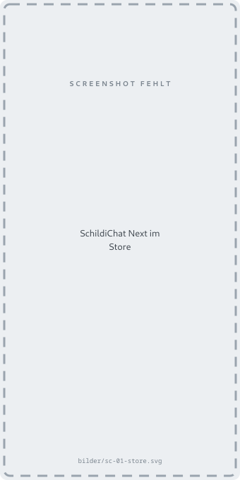
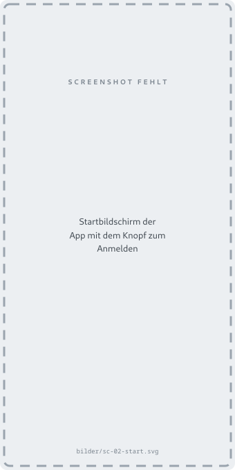
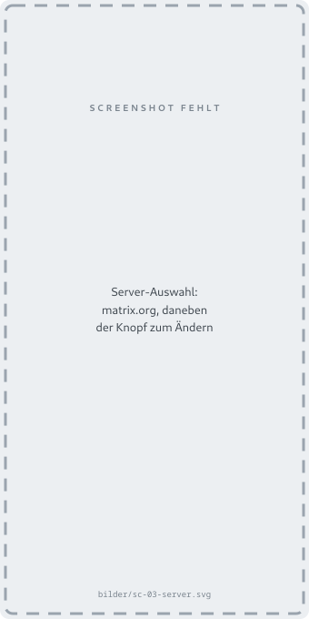
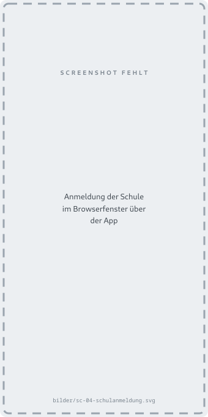

# SchildiChat Next einrichten

SchildiChat Next ist ein Ableger von [Element X](element-x.md) und verhält sich
fast genauso. Es bringt Sprechblasen mit, eine kompaktere Liste und ein paar
Einstellungen mehr.

!!! info "Nur für Android"

    Für das iPhone gibt es SchildiChat Next nicht. Dort führt der Weg über
    [Element X](element-x.md) oder [den Browser](web.md).

!!! warning "Noch nicht ganz fertig"

    Die Entwickler bezeichnen SchildiChat Next selbst als Beta: Es fehlen
    einzelne Funktionen, die Element X schon hat. 
    Deswegen wird zu Schildichat hier keine Anleitung gegeben. Die App funktioniert, 
    die Einrichtung läuft ganz ähnlich ab, wie bei Element X, ist aber nicht fertig.
<!-- ## 1. Installieren

SchildiChat Next gibt es im **Play Store** und bei **F-Droid**. Beide Wege
führen zur selben App; welcher der bequemere ist, sagt einem das eigene Handy
am besten selbst.

Die Übersicht aller Bezugswege steht auf [schildi.chat](https://schildi.chat/).



!!! tip "Nicht das alte SchildiChat erwischen"

    Es gibt daneben noch **SchildiChat Legacy** — den Vorgänger. Gemeint ist
    hier die Fassung mit **Next** im Namen.

## 2. Anmelden auswählen

App öffnen und auf dem Startbildschirm auf **„Anmelden“** tippen. Ein Konto
anlegen muss man nicht — das Schulkonto gibt es schon.



## 3. Den Server der Schule eintragen

Wie bei Element X schlägt die App `matrix.org` vor. Das ist **nicht** der Server
der Schule.

Auf **„Ändern“** beziehungsweise **„Bearbeiten“** tippen und eintragen:

```
werkgymnasium.eu
```



!!! note "Warum `werkgymnasium.eu` und nicht die lange Adresse"

    Beides führt zum Ziel, aber die kurze Form ist die richtige: Sie ist die
    Adresse der Schule im Chat-Netz, und der Server sagt der App von selbst, wo
    er technisch erreichbar ist. Wer die lange Form einträgt, bekommt am Ende
    dieselbe Verbindung — nur steht dann in der eigenen Adresse etwas anderes
    als bei allen anderen.

## 4. Mit dem Schulkonto anmelden

Es öffnet sich ein Browserfenster mit der Anmeldeseite der Schule. Dort das
gewohnte Schulkonto eingeben, und falls gefragt wird, ob die App auf das Konto
zugreifen darf: bestätigen.



## 5. Die Verschlüsselung freischalten

Ab hier ist SchildiChat Next nicht von Element X zu unterscheiden. Wie man ein
neues Gerät freischaltet und was es mit dem Wiederherstellungsschlüssel auf sich
hat, steht deshalb dort:

[:octicons-arrow-right-24: Schritt 5 bei Element X](element-x.md#5-die-verschlusselung-freischalten)

Dort steht auch, was zu tun ist, wenn die App **gar nicht erst fragt** — der
häufigste Fall, wenn das zweite Gerät gerade nicht geöffnet war.

!!! danger "Kurzfassung, falls es das erste Gerät überhaupt ist"

    Die App zeigt einmal einen **Wiederherstellungsschlüssel** an. Den
    wegspeichern. Ohne ihn kommt man auf einem neuen Handy nicht mehr an alte
    Nachrichten, und niemand kann ihn nachträglich herausgeben — auch die
    Schule nicht.

---

Fertig. Wie man jemanden findet und wie die eigene Adresse aussieht, steht auf
der [Übersichtsseite](index.md). 
-->
