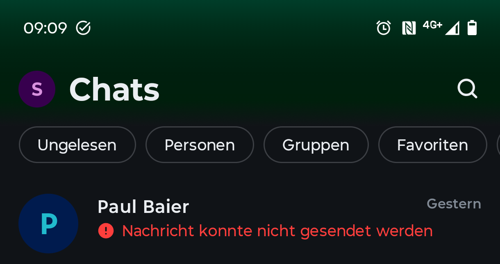
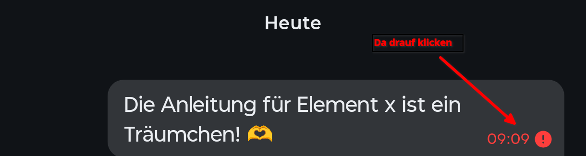
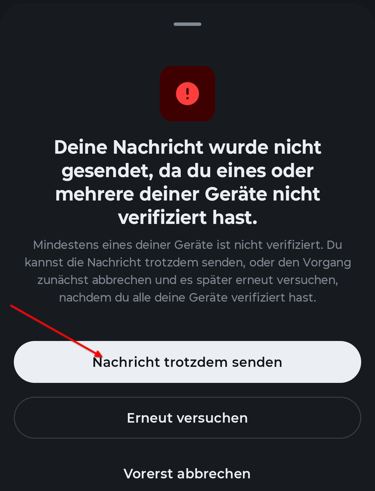
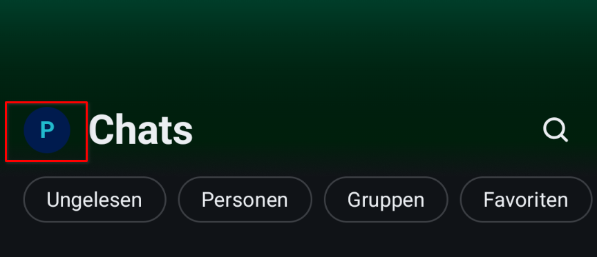
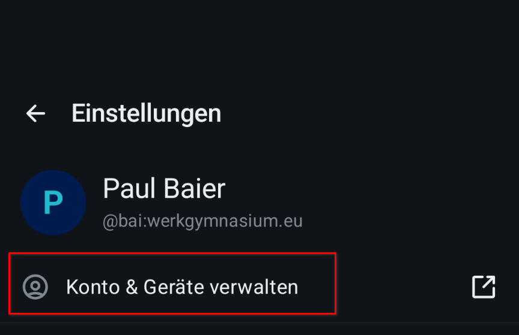
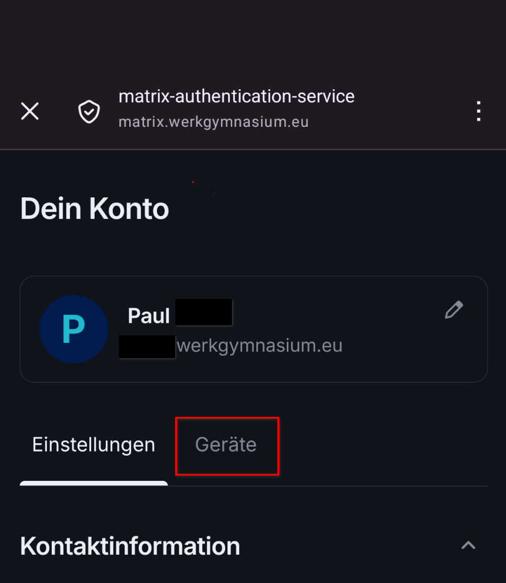
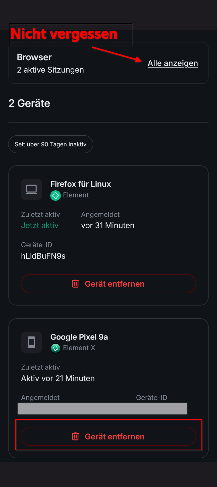
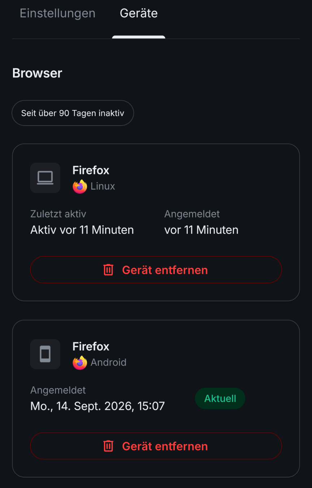

# Sitzungen verifizieren

Jede Anmeldung — Handy, Browser, Tablet — legt eine eigene **Sitzung** an. Eine
Sitzung, die nicht bestätigt wurde, gilt für Element als unbekannt, und darauf weist es hartnäckig hin.

## Woran man es merkt

Es gibt drei Symptome des gleichen Problems:

- Die Nachricht geht nicht raus. Im chat erscheint: Einige Nachrichten konnten nicht gesendet werden.
- eine Warnung über **„nicht verifizierte Sitzungen"**,
- Nachrichten, die als **„Nicht entschlüsselbar"** dastehen.

Dahinter steckt dreimal dasselbe: Es gibt eine Sitzung des eigenen Kontos, der
noch niemand bestätigt hat, dass sie wirklich einem selbst gehört. Meist ist
das keine fremde Person, sondern eine **eigene alte Anmeldung** — das Handy von
vorletztem Jahr, ein Browser im Computerraum, eine App, die längst deinstalliert
ist.

!!! info "Die Bilder zeigen Element X"

    Im Browser und in SchildiChat Next sieht es etwas anders aus. Die Wörter
    sind dieselben, und der Weg unten gilt für alle drei.

## Wenns schnell gehen muss

## Alte Sitzungen entfernen

Die Liste der Anmeldungen steht nicht in Element selbst, sondern auf der
**Kontoseite**. Sie ist für alle Geräte dieselbe: Vom Handy aus sieht man auch
die Anmeldungen im Browser und umgekehrt.

=== "**Auf dem Handy**"

    Oben links auf das **eigene Bild** tippen, dann auf **Konto & Geräte
    verwalten**. Es öffnet sich ein Browserfenster.

    

    

    

    

=== "**Im Browser**"

    Oben links auf das **eigene Bild** klicken, dann auf **Manage account**.

    

So oder so landet man auf derselben Seite: **Dein Konto**. Sie hat oben zwei
Reiter — der rechte heißt **Geräte** und ist der, um den es geht. Dahinter steht
oben ein Kasten **Browser** und darunter die Liste der einzelnen Geräte.

Dort steht jede Anmeldung mit Programm, Betriebssystem, dem Datum und einer
**Geräte-ID**. Zwei Dinge helfen beim Sortieren:

- Die gerade benutzte Sitzung trägt ein grünes **Aktuell** — die bleibt.
- Man kann sehen, welche die Sitzungen sind, die sich schon länger nicht
  angemeldet haben.

!!! danger "Bitte nicht ausversehen alle Sitzungen abmelden"
    Die kürzlichen Sitzungen auf eurem aktuellen Handy müssen da bleiben.
     Wenn es die **letzte** angemeldete
    Sitzung ist und der Wiederherstellungsschlüssel fehlt, führt kein Weg mehr
    zu den alten Nachrichten zurück. Dann hilft nur ein Reset.

!!! warning "Was dabei verloren geht"

    Auf dem entfernten Gerät sind die Nachrichten weg. Das ist gewollt und
    genau der Zweck der Sache; auf allen anderen eigenen Geräten bleibt alles,
    wie es war.

!!! danger "Auf dieser Seite steht auch „Account löschen“"

    Im **linken** Reiter *Einstellungen* liegen weiter unten zwei rote Elemente
    direkt untereinander: **Vom Konto abmelden** und **Account löschen**. Das
    zweite ist endgültig und hat mit Sitzungen nichts zu tun. Wer hier arbeitet,
    bleibt im Reiter **Geräte**.

!!! info "Eine nachträgliche Verifizierung ist nicht mehr möglich"

    Element verlangt inzwischen — anders als früher — dass alle Sitzungen schon
    bei der Anmeldung verifiziert werden. Alte unverifizierte Sitzungen kann man
    demnach getrost entfernen.

Wie die Verifizierung beim **ersten** Einrichten abläuft, steht in den
Anleitungen selbst: [Element X](element-x.md) und [im Browser](web.md). Nur
diesen einen Rechner hier abmelden — etwa im Computerraum — geht schneller und
steht [dort](web.md#6-am-fremden-rechner-abmelden).
