# Im Browser anmelden

Der Weg ohne Installation: Es genügt ein Browser. Das ist der richtige Weg am
eigenen Rechner — und der einzige am Schulrechner oder an einem geliehenen
Gerät.

[element.werkgymnasium.eu öffnen](https://element.werkgymnasium.eu){ .md-button .md-button--primary target="_blank" rel="noopener" }

## 1. Die Seite öffnen

Die Adresse `element.werkgymnasium.eu` im Browser aufrufen. Es erscheint ein
Begrüßungsbildschirm mit einem Knopf zum Anmelden. **Klicke danach auf Fortfahren**

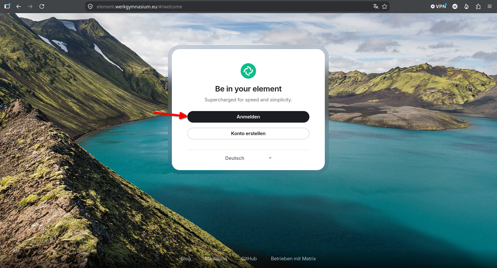

!!! tip "Es gibt nur diesen einen Knopf"

    Wenn irgendwo nach einem eigenen „Benutzernamen und Passwort" für Element
    gefragt wird, ist das der falsche Weg. Der Chat der Schule kennt **nur** die
    Anmeldung über das Schulkonto.

## 2. Das vorausgewählte bestätigen
Nun bestätigt man und fährt fort.

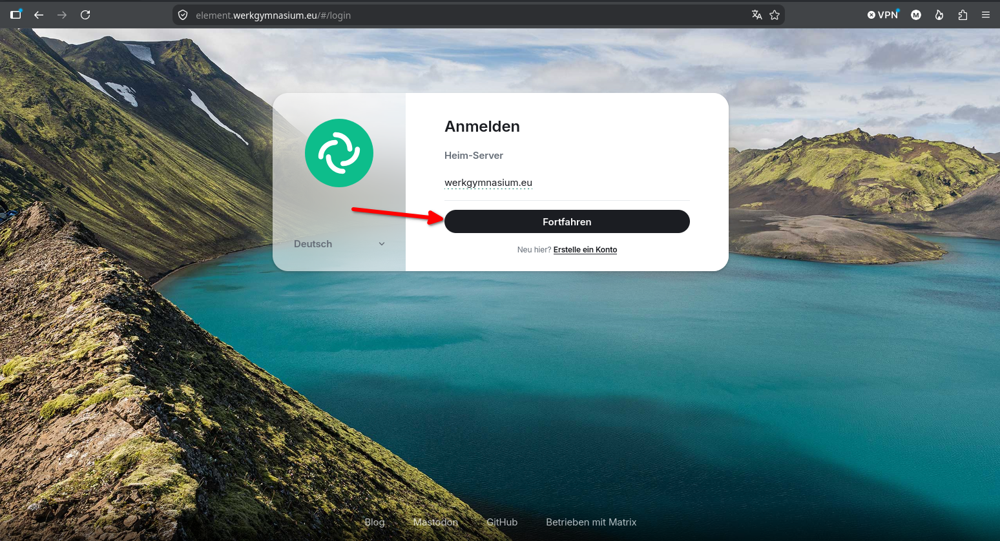

## 3. Mit dem Schulkonto anmelden

Nach dem Klick springt der Browser auf die Anmeldeseite **authentik**. Dort das **gewohnte Schulkonto** eingeben — dasselbe Kürzel und dasselbe Kennwort wie am Schulrechner. 

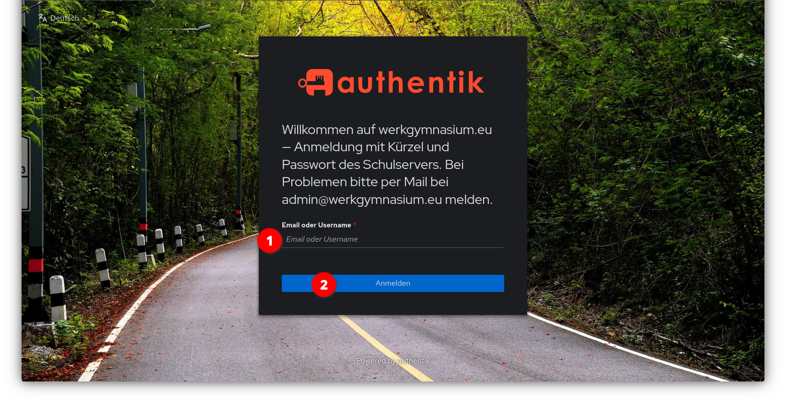

## 4. Den Zugriff bestätigen

Danach bestätigt man, dass man sich wirklich mit seinem Schulkonto bei Element
anmelden möchte.

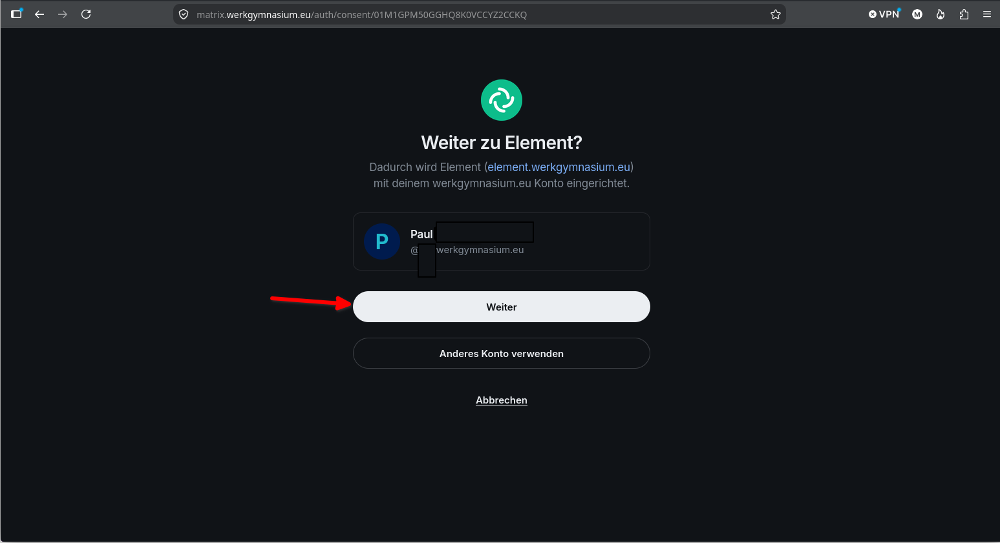

## 5. Die Verschlüsselung freischalten und das Gerät verifizieren
??? info "Verifizieren?"
    Die Geräteverifizierung schützt vor Betrügern und anderen böswilligen Akteuren, die Angriffe im Man-in-the-Middle-Stil versuchen.

    Mit Element kannst Du jedes Gerät verfolgen, das an einer verschlüsselten Konversation teilgenommen hat. Wenn ein neues und unerwartetes Gerät beitritt, kannst Du mithilfe der Geräteüberprüfung überprüfen, ob es sich um die richtige Person handelt. Wenn Du den Verdacht hast, dass ein vertrauenswürdiges Gerät in die falschen Hände geraten ist, kannst Du dieses Vertrauen aufheben und ihm den Zugriff auf die laufende verschlüsselte Konversation entziehen. 

Beim **ersten Mal** in einem Browser fragt Element nach der Verschlüsselung.
Was zu tun ist, hängt davon ab, ob es schon ein **angemeldetes Gerät** gibt:

=== "**Es gibt schon ein Handy oder einen anderen Rechner**"
    
    Element bietet an, die Anmeldung auf einem Gerät zu bestätigen, auf dem schon Element eingerichtet ist:
    
    Man wählt aus  **Nimm ein anderes Gerät**

    ??? tip   "Kein Gerät mehr zur Hand? Alternativ nimmt Element den **Wiederherstellungsschlüssel**"
        Der Wiederherstellungsschlüssel ist eine lange
        Folge aus Buchstaben und Ziffern, die beim allerersten Einrichten vergeben
        wurde.

        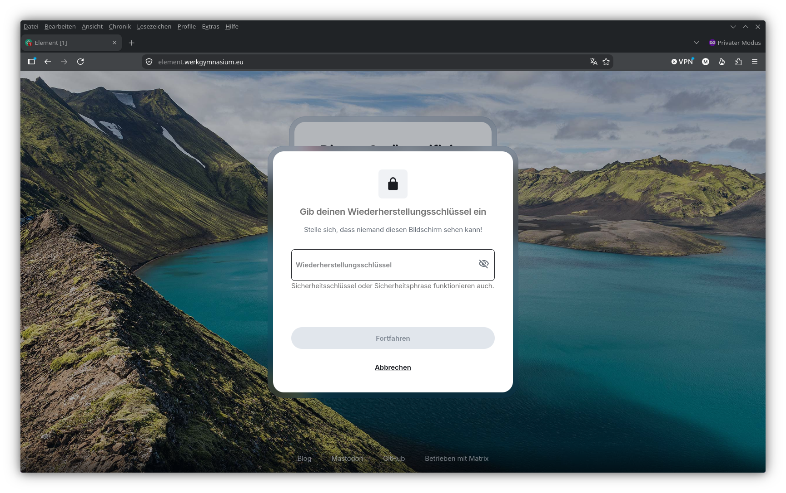
    Auf dem anderen Gerät erscheint eine Nachfrage (Das kann ein paar Sekunden dauern) — bestätigen, und in beiden Fenstern erscheinen dieselben Zeichen oder Bilder. Stimmen sie überein, auf „Sie stimmen überein" klicken.

    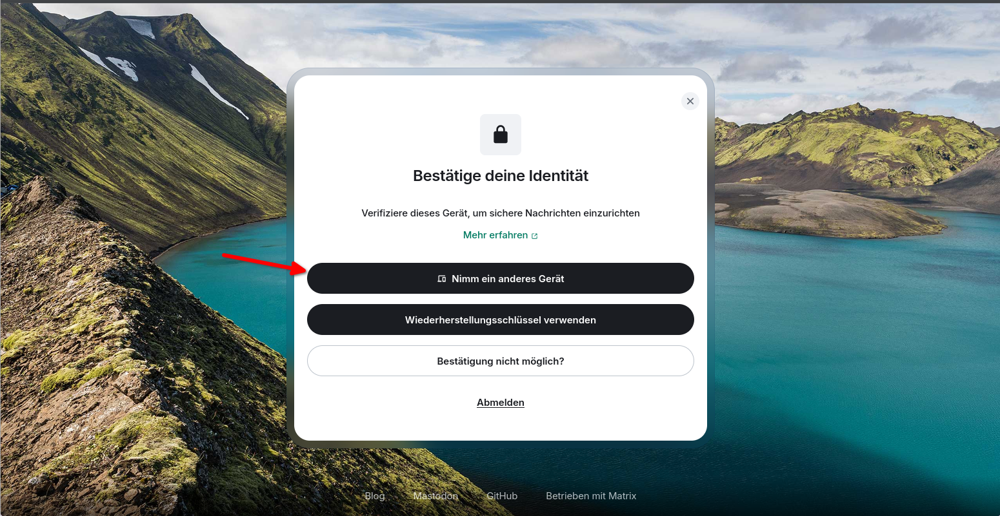

    
    **Auf dem anderen Gerät** erscheint eine Nachfrage (Das kann ein paar Sekunden dauern) — bestätigen, und in beiden Fenstern erscheinen
    dieselben Zeichen oder Bilder. Stimmen sie überein, auf **„Sie stimmen
    überein"** klicken.

    

    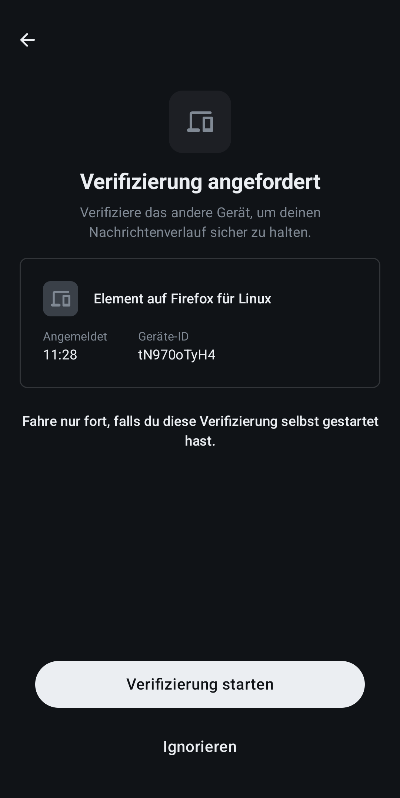

    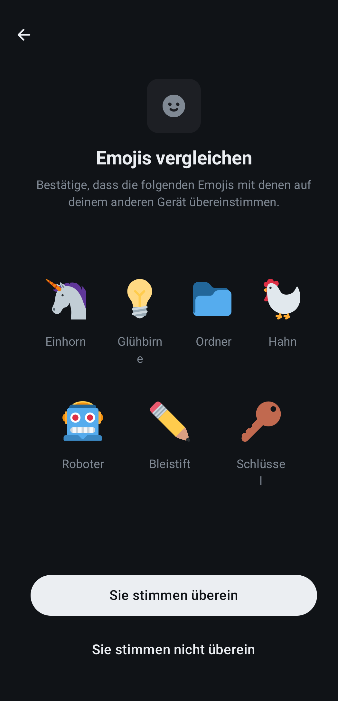

    

    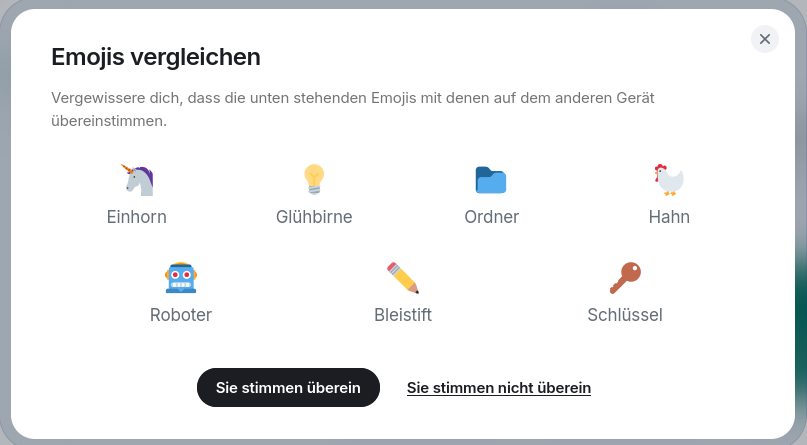

   
=== "**Es ist das allererste Mal**"

    Dann gibt es noch nichts zu bestätigen, und Element legt die Wiederherstellung
    neu an. Es zeigt dabei einmal den **Wiederherstellungsschlüssel** an.

    !!! danger "Diesen Schlüssel wegspeichern — jetzt"

        Ohne ihn kommt man auf einem neuen Gerät nicht mehr an alte Nachrichten.
        Niemand kann ihn nachträglich herausgeben, auch die Schule nicht.

        Gute Orte: ein Passwortprogramm, ein
        Zettel im Geldbeutel. Schlechte Orte: eine Nachricht an sich selbst im
        Chat — die ist ja genau das, was ohne den Schlüssel unlesbar wird.

<!-- 
## 5. Jemanden suchen

Oben auf die **Suche** klicken und Namen oder Kürzel eingeben.

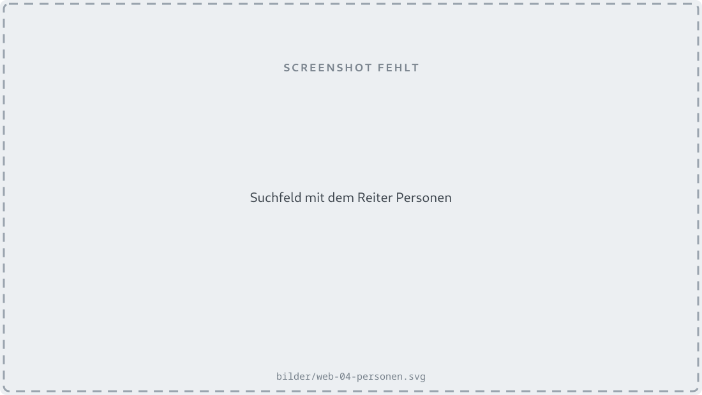

!!! danger "Wichtig: auf „Personen" umschalten"

    Die Suche zeigt zuerst nur die eigenen Räume und Kontakte. Wer jemanden
    sucht, mit dem er noch **nie** geschrieben hat, muss oben auf **„Personen"**
    wechseln — sonst fragt Element den Server gar nicht erst und meldet, es gebe
    niemanden.

    Das ist keine Fehlfunktion, sondern so gebaut. Es kostet trotzdem
    regelmäßig Nerven. 
-->

## 6. Am fremden Rechner: abmelden

In der Bibliothek, im Computerraum, auf einem geliehenen Gerät: Wer das Fenster
nur schließt, bleibt angemeldet. Der Nächste am selben Rechner sitzt dann im
fremden Konto.

Richtig abmelden geht über das eigene Bild oben links → **Mange Account**.

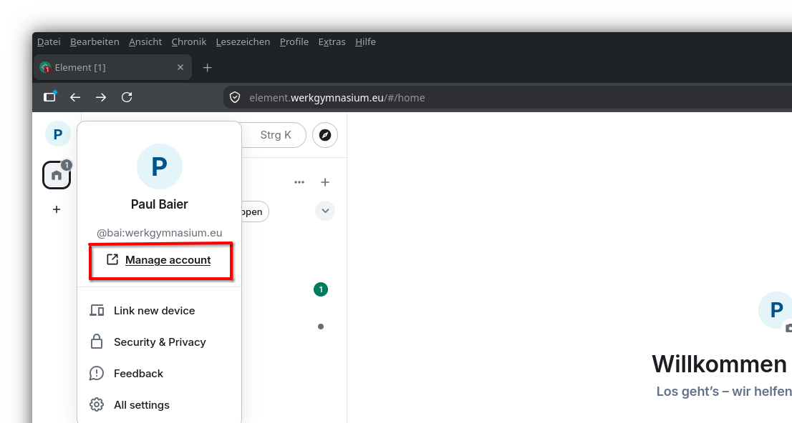

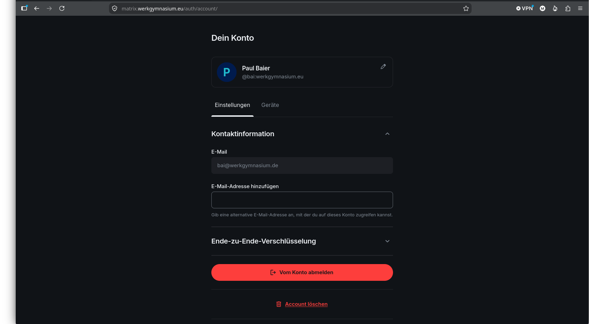

!!! warning "Abmelden löscht die Nachrichten auf diesem Rechner"

    Das ist gewollt und der Sinn der Sache. Auf den anderen eigenen Geräten
    bleibt alles, wie es war.

    Nur eines sollte man vorher geklärt haben: Wenn dies das **einzige**
    angemeldete Gerät ist und der Wiederherstellungsschlüssel fehlt, ist der Weg
    zurück zu den alten Nachrichten verbaut. Siehe Schritt 4.
